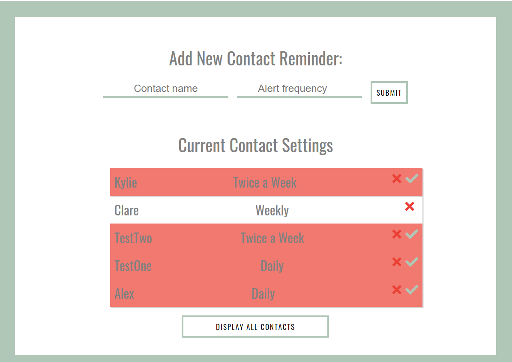

# Wellbean

### Created and developed by [Alex Morton](https://alexlsalt.github.io/)  

Wellbean is an app I created to help users stay in contact on a consistent basis with their loved ones. 
With the ability to add contacts' names and the desired reminder frequency, users will be notified of which contacts 
are overdue to reach out to each time they log in to the app.

## About

In April 2020, I felt inspired to develop an app that helped me keep track of which of my loved ones to contact on any given day. I'd often lose track of who I had and hadn't spoken to in a long time, and I wanted to create something that would remove the confusion and just notify me of who of my friends or family would be a good idea to call, based on how much time had passed since I'd last spoken to them.

### How it works

Essentially, the program runs each time a user logs in to compare the present time to the time a contact reminder was created. If the difference between the time now and the time the contact was created exceeds a given number of hours (depending on the desired reminder frequency), the contact's list item will turn red, signalling it's time to reach out to said contact.

The app itself uses Firebase Firestore and Firebase Authentication to store users' contacts in a database. Once users have created an account using an email address and password, they'll have access to the logged in page, where they'll have the option to enter a contact name and reminder frequency. 

Once that information is submitted, it will immediately show up on the list below the input form, in addition to being added to the database.

Depending on the logged-in user, the program will return only those documents in the database that have an ID property that matches their unique user ID (UID) that they receive at the time their account is created. In other words, upon each contact submission into the input form, the program grabs the user's UID and sets a property of 'id' as that UID within the overall object of the particular contact.

    const contactName = document.querySelector('#newContact__input').value;
    const contactFrequency = document.querySelector('#newFrequency__input').value;

    const ID = auth.currentUser.uid;

    let data = {}

    if (contactName !== '' && contactFrequency !== '') {
      data['name'] = contactName;
      data['frequency'] = contactFrequency;
      data['id'] = ID;
      data['created_on'] = Date.now() / 3600000; // Milliseconds > hours

    db.collection('contacts').doc().set(data);
    

Also upon submission, there is also a property called created_on that is set with a timestamp of the present moment using the Date object in JavaScript (in hours because milliseconds can become very unruly very quickly). This is an important aspect of the overall timing function of the app.

Each time the user logs in, another snapshot of the current time is taken (again by using the now() method on the Date object), and the
program uses that in its logic to test if the time now subtracted by the created_on property is greater than a given number of hours 
(depending on the frequency set in each contact's data object).

    db.collection('contacts').where('id', '==', `${userId}`).get()
    .then(snapshot => {
      if (snapshot.empty) {
        console.log('No matching docs');
      }
    
      snapshot.forEach(doc => {
        let id = doc.id;
        let createdOn = doc.data().created_on;
        let frequency = doc.data().frequency;

        // This function will update the UI each time the timer expires on each list item
        function timerExpired() { 
          document.getElementById(`${id}`).classList.add('expired');
          document.getElementById(`${id}`).childNodes[2].insertAdjacentHTML('beforeend', 
          '<i class="fas fa-check"></i>');
        }
       
        // The timing logic for each frequency option
        if (now - createdOn > 24 && frequency == 'Daily') {
          timerExpired();
        } else if (now - createdOn > 84 && frequency == 'Twice a Week') {
          timerExpired();
        } else if (now - createdOn > 168 && frequency == 'Weekly') {
          timerExpired();
        } else if (now - createdOn > 336 && frequency == 'Every Two Weeks') {
          timerExpired();
        } else if (now - createdOn > 720 && frequency == 'Monthly') {
          timerExpired();
        }      
      });

## Features

- Reset function of the timer once the current timer expires

If the user logs in and the timing logic returns true for any of the conditions, the timerExpired() function fires to update the contact
list on the UI. For any overdue contacts, the list item will be given a class with a red background. Also, once the timerExpired() function fires, it will also display a green checkmark on the list item for the user to click once they'd like to reset the timer (if, for example, they've reached out to their contact). 

Once the green checkmark is clicked, it will remove the class giving the list item the red background, and it will set a new created_on value within the contact's object in the database, which will give the program a new value to compare against within the timing logic.

    let checkmarks = document.querySelectorAll('.fa-check');
      checkmarks.forEach(check => {
        check.addEventListener('click', e => {
          e.stopPropagation();
          let itemID = e.target.parentNode.parentNode.id;

          // Need parseInt - otherwise will be updated in database as a string instead of a number
          let now = parseInt(Date.now() / 3600000);

          // Update the created_on property in Firestore so that the timing interval starts over
          db.collection('contacts').doc(`${itemID}`).update({ created_on: now });

          // Update the list/UI
          document.getElementById(`${itemID}`).classList.remove('expired');
          e.target.style.display = 'none';

        })
      });
